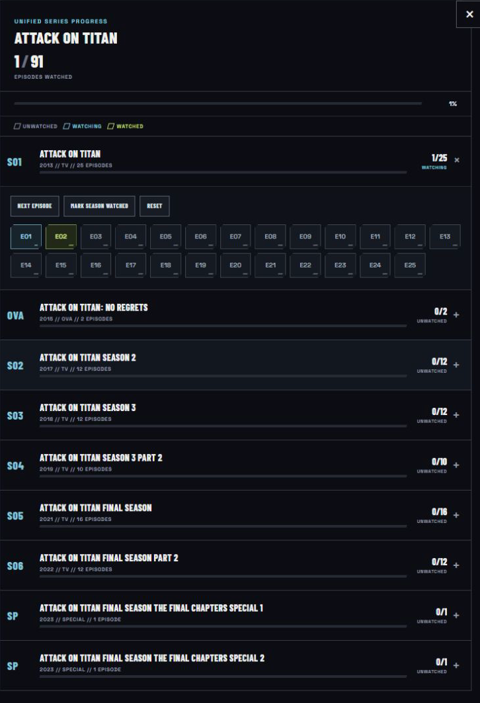

# Ultimate Animation Index

[](https://github.com/Firehawk52/ultimate-animation-index/actions/workflows/ci.yml)


A private-by-default, self-hosted watchlist for anime and animation from every era,
genre and country. Browse a ranked catalog, track what you watch, build favorites,
follow franchise watch orders and exchange cryptographically signed recommendation
lists.

There is no title limit. The list can keep growing as new and older work is added.

See the [changelog](CHANGELOG.md) for release history and version 2.0 details.

## Highlights

- **One worldwide catalog:** anime, films, OVAs, donghua and animation beyond Japan
- **Local personal data:** progress, ratings, notes and favorites stay in your browser
- **Selectable rating format:** use either the S–D letter scale or a 10-point scale throughout the interface
- **Update notifications:** receive an in-app link when a newer GitHub release is available
- **Cover-level progress:** distinct status icons show not started, watching, completed,
  on hold and dropped titles without opening their details
- **Unified episode tracking:** AniList sequels and prequels are grouped into seasons under one series,
  with the same episode state shown in title details and franchise guides
- **Curated navigation:** rankings, filters, collections and detailed franchise guides
- **Clear content guidance:** separate severity levels for sexual content, nudity,
  violence, gore and disturbing material
- **Signed sharing:** portable UserList codes protected by Ed25519 signatures
- **Offline-friendly artwork:** covers are downloaded once and cached locally
- **Contributor-friendly source:** generated files and runtime data never enter Git

## Screenshots

### Ranked master catalog

The landing view gives the full catalog a clear editorial hierarchy. Search, filters,
quality tiers and personal progress tools sit on top of the same canonical title list.


### Content severity at a glance

Adult-content dimensions are scored independently instead of being collapsed into one
age label. Bar length, color, plain-language severity and the numeric source value all
communicate the same level without relying on color alone.


### One tracker for the complete series

Connected AniList seasons, OVAs and concluding specials appear in one compact tracker.
Every episode has a distinct Unwatched, Watching or Watched state, while season controls
handle common actions without turning the interface into a spreadsheet.



### Practical franchise guides

Complex franchises are expressed as readable viewing paths with chronology notes,
episode jumps and explicit `ESSENTIAL`, `OPTIONAL` or `SKIP` decisions.


## Quick start

Install [Node.js 20+](https://nodejs.org/), then run:

```bash
git clone https://github.com/Firehawk52/ultimate-animation-index.git
cd ultimate-animation-index
npm start
```

Open [http://localhost:8787](http://localhost:8787). On the first run, the catalog is
generated automatically before the server starts.

Windows and macOS users can also use the included launchers after cloning:

- Windows: double-click `RUN.bat`
- macOS: double-click `RUN.command`

## How it works

```text
Curated JSON source
        │
        ▼
public/catalog.json ──► Browser application ──► Local watch data
        │                        │                    │
        │                        ▼                    ▼
        └──────────────► Metadata providers      localStorage
                                 │
                                 ▼
                         Local cover cache
```

`npm start` generates the catalog when it is missing or its version-controlled source
has changed. The Node.js server then serves the browser application, validates signed
UserLists, enriches titles with public metadata and gradually fills the local artwork
cache.

## Project structure

```text
.
├── data/                 # Human-maintained catalog source
├── public/               # Browser application; catalog.json is generated locally
├── scripts/              # Cross-platform build and startup helpers
├── server.mjs            # Static server, metadata cache and UserList API
├── test/                 # Node.js integration tests
└── .github/workflows/    # Automated GitHub checks
```

The browser is dependency-free at runtime. Node.js validates the catalog source,
generates the local browser database and serves the static files and small local API.

The repository contains source code only. Generated catalog data, covers, metadata
caches, signing keys and installed packages are intentionally excluded from Git.

| Generated locally     | Purpose                                |
| --------------------- | -------------------------------------- |
| `public/catalog.json` | Browser-ready catalog                  |
| `covers/`             | Downloaded artwork                     |
| `.cache/`             | Provider metadata cache                |
| `.userlist-keys/`     | Installation-specific signing identity |
| `node_modules/`       | Development tooling                    |

## The easy way to run it

### Windows

1. Install Node.js 20 or newer.
2. Double-click `RUN.bat`.
3. Your default browser opens automatically when the server is ready.
4. Keep the terminal window open while you use the site.

### macOS

1. Install Node.js 20 or newer.
2. Double-click `RUN.command`.
3. Your default browser opens automatically when the server is ready.

### Linux

Run:

```bash
./start.sh
```

The default address is:

```text
http://localhost:8787
```

You can also run the server with:

```bash
npm start
```

## Development

Requirements:

- Node.js 20 or newer

Install the development formatter and run the project checks:

```bash
npm install
npm run format:check
npm run check
npm test
```

Useful commands:

| Command                 | Purpose                                                  |
| ----------------------- | -------------------------------------------------------- |
| `npm start`             | Generate a missing catalog, then start on port 8787      |
| `npm run update`        | Safely update, synchronize packages and rebuild locally  |
| `npm run build:catalog` | Validate the source and regenerate `public/catalog.json` |
| `npm run format`        | Format the human-maintained web and documentation files  |
| `npm run check`         | Check JavaScript syntax                                  |
| `npm test`              | Run server integration tests                             |

Pull requests run the same checks through GitHub Actions. The workflow builds and
tests the catalog without adding the generated file to Git.

## What is included

- Master ranking with search, filters and sorting
- Favorites as a separate private list
- Studio, director and creator collections
- Franchise watch-order guides with chronology and episode jumps where needed
- Adult section with Ecchi, Erotic, Hentai, Gore, Extreme Violence and Disturbing filters
- Plain-language content levels for Sexual content, Nudity, Violence, Gore and Disturbing content
- Personal watch status, ratings and private notes
- S–D or 10-point rating display, saved as a local interface preference
- Per-episode Unwatched, Watching and Watched progress grouped by connected seasons
- Recommended / Not recommended marks
- Signed UserList sharing by text code
- Custom title additions with global duplicate checking
- Local cover storage in `covers/`

## Covers and metadata

The catalog works without live metadata. The server looks up covers and public metadata using AniList, Jikan,
TVmaze and Wikipedia. Custom titles are matched conservatively across these providers; the user's title is never
silently replaced by a provider result. When available, provider tags, genres and age classifications are also
converted into editable 0–5 content-rating estimates. These estimates are deliberately conservative and should
be reviewed by the user before sharing a UserList. A custom title can be removed from its detail dialog with a
two-step confirmation; its associated local progress, opinion, favorite and cached metadata are removed with it.

### Rating formats

Choose **Letter scale** or **10 scale** from the master toolbar or from any title's personal-rating editor. The
preference changes both editorial quality labels and the personal rating control, and is restored after refresh.

The equivalent values are `D = 5`, `C = 6`, `B = 7`, `A = 8`, `A+ = 9` and `S = 10`. Personal ratings remain
numeric internally, so switching formats does not alter existing ratings and sorting, backup and import remain
compatible between formats.

When a cover is found, the server downloads it once and stores it locally in:

```text
covers/
```

Normal page views then use the local file. The site does not need to download the same cover again every time it opens.

The server also warms the cover cache in the background after startup. The browser does not need to remain open for that process; keep the local server running and it will continue filling the `covers/` folder.

Metadata lookup results are stored in:

```text
.cache/metadata.json
```

Keep `covers/` when updating the app if you want to preserve downloaded artwork.

## Unified season and episode progress

For AniList-backed series, the server follows AniList's official `PREQUEL` and `SEQUEL`
relations to group separately listed seasons and concluding specials under one catalog title.
Western and other TVMaze-backed shows use the provider's embedded episode list and are
grouped by season. The integrations follow the [AniList Media relations documentation](https://docs.anilist.co/guide/graphql/queries/media#get-the-relations-of-a-media)
and the [official TVMaze show and episode API](https://www.tvmaze.com/api#show-episode-list).

Each episode starts as **Unwatched** and can be cycled to **Watching**, **Watched** and
back to **Unwatched**. Season-level actions can advance to the next episode, mark a full
season as watched or reset it. The same sparse local state powers both the title detail
dialog and its franchise guide, so the two views cannot drift apart.

Episode progress stays in the current browser under `uai:episode-progress:v1`. It is
private local data and is not included in exported UserLists.

Series metadata is status-aware. Fully finished or cancelled groups are fetched once and
then kept in the local/server cache without automatic retries. Groups containing AniList
entries marked `RELEASING`, `NOT_YET_RELEASED` or `HIATUS` are checked whenever their
tracker is opened, allowing newly published episodes and connected seasons to appear while
preserving the existing episode progress.

## UserList sharing

UserList uses one copy-and-paste text code instead of a shared file.

A code looks like:

```text
UWL.<key-id>.<public-key>.<base64url-data>.<signature>
```

A shared UserList can contain:

- Recommended / Not recommended marks
- Missing titles added by the sender when those titles are needed by the list
- Genres, content labels and five independent content-severity ratings for custom titles

It does not contain:

- The sender's display name
- Favorites
- Watch status
- Personal ratings
- Private notes

The person importing the code chooses the source name locally.

### Private backup and restore

The UserList page can also download a private JSON backup. Unlike a signed sharing code,
this file is intended only for the owner and includes:

- Watch statuses, ratings and private notes
- Favorites and per-episode progress
- Personal recommendation marks
- Custom titles with editable metadata and content ratings
- Imported UserList sources
- Saved searches, filters, sorting and interface preferences

Backup files are created entirely in the browser and are never uploaded to the server.
They are readable JSON rather than encrypted archives and should be kept private.
On import, every record is validated before any local storage is changed. **Merge** keeps
existing local data and lets backup values resolve conflicts, while **Replace** restores
only the selected backup. Storage writes are rolled back if the browser cannot complete
the full import.

### Tamper protection

Each UserList is signed with Ed25519. The portable `UWL` envelope contains the sender's public key so another
installation can verify the signature and strict schema before changing local data. A modified, malformed or
oversized code is rejected without a partial import.

The identifier after `UWL.` is a fingerprint of the embedded public key. Neither the fingerprint nor the public
key can be used to forge that sender's signature. UserList payloads are readable rather than encrypted, but any
edit invalidates the signature. A public key proves that the code has not changed since it was signed; users must
still decide whether they trust the person who shared that fingerprint. A successful import displays the verified
fingerprint so it can be compared with the sender through a separate trusted channel when identity matters.

The server creates its signing keys on first run in:

```text
.userlist-keys/
```

Keep this folder when updating the same installation so its public fingerprint remains stable.

Never share the private key file.

Runtime data in `.userlist-keys/`, `.cache/` and `covers/` is intentionally excluded
from Git. Do not force-add these folders: signing keys are private and cached metadata
or artwork can be regenerated.

## Third-party content and copyright

This project indexes works created and owned by third parties. Titles, trademarks,
provider metadata, descriptions, cover artwork and other referenced media remain the
property of their respective owners. Their appearance in the index does not transfer
ownership or grant a license to reuse them.

The repository and application do not contain, download, stream or distribute films,
episodes or any other video files. The system is an index only; runtime downloads are
limited to metadata and cover artwork used to identify catalog entries.

The application can download and cache cover artwork and public metadata from external
providers at runtime. Generated caches and downloaded covers are excluded from Git, but
documentation screenshots may display third-party artwork as part of the interface.
These materials are included for identification and informational purposes only and are
not covered by any license that may apply to the project's own source code.

Operators and contributors are responsible for ensuring that their use and distribution
of third-party material complies with applicable licenses, provider terms and local law.

## Duplicate handling

A title exists only once in the local database.

If the same work appears in several imported UserLists, the existing title receives additional source opinions instead of creating duplicate cards. Manual additions use the same duplicate checks.

Aliases are normalized where possible. Separate remakes or adaptations can still exist as separate works when their year or identity differs.

## Rebuilding the catalog

The human-maintained source is in `data/catalog-source.json`. Node.js validates its
structure, duplicate IDs and collection references before generating the browser copy.

Run this when you want to rebuild it explicitly:

```bash
npm run build:catalog
```

This regenerates the browser's catalog:

```text
public/catalog.json
```

The generated JSON is formatted with indentation and line breaks for local inspection.
It is ignored by Git and should not be edited or committed. Edit the source file
instead. If `public/catalog.json` is missing or outdated, `npm start` creates it
automatically with the included Node.js build script.

## Contributing and security

See [CONTRIBUTING.md](CONTRIBUTING.md) for the expected workflow and data-editing
guidelines. Please report security-sensitive problems privately as described in
[SECURITY.md](SECURITY.md).

## Updating an existing installation

When the site reports a new version, select **UPDATE NOW**. The local server safely
fast-forwards the installation from `origin/main`, synchronizes packages, regenerates
the catalog, restarts itself in the background and refreshes the page automatically.

The same update can be started without the browser:

- Windows: close the running server and double-click `UPDATE.bat`
- macOS: close the running server and double-click `UPDATE.command`
- Linux: close the running server and run `./update.sh`
- Any platform: close the running server and run `npm run update`

Automatic updating requires a Git clone on the `main` branch. It stops before changing
anything if tracked source files have local modifications. Contributors should commit
or stash their work and update manually when branches have diverged.

Updates preserve private runtime data:

1. Keep `.userlist-keys/`.
2. Keep `covers/` if you want to retain downloaded covers.
3. Keep `.cache/` if you want to retain provider metadata.
4. Browser watch data remains in the same browser storage.
