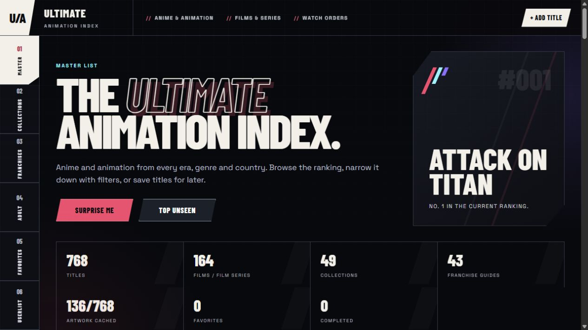
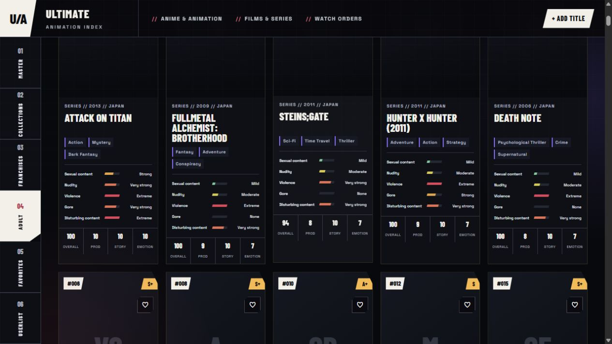
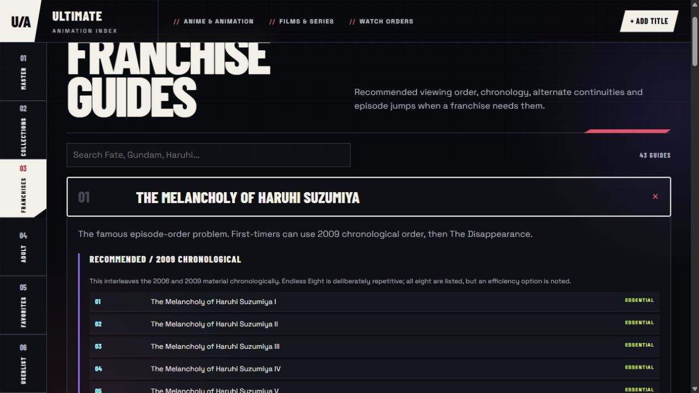

# Ultimate Animation Index

[](https://github.com/Firehawk52/Ultimate_Animation_Index/actions/workflows/ci.yml)


A private-by-default, self-hosted watchlist for anime and animation from every era,
genre and country. Browse a ranked catalog, track what you watch, build favorites,
follow franchise watch orders and exchange cryptographically signed recommendation
lists.

There is no title limit. The list can keep growing as new and older work is added.

## Highlights

- **One worldwide catalog:** anime, films, OVAs, donghua and animation beyond Japan
- **Local personal data:** progress, ratings, notes and favorites stay in your browser
- **Curated navigation:** rankings, filters, collections and detailed franchise guides
- **Clear content guidance:** separate severity levels for sexual content, nudity,
  violence, gore and disturbing material
- **Signed sharing:** portable UserList codes protected by Ed25519 signatures
- **Offline-friendly artwork:** covers are downloaded once and cached locally
- **Contributor-friendly source:** generated files and runtime data never enter Git

## Screenshots

### Ranked master catalog

The landing view gives the full catalog a clear editorial hierarchy. Search, filters,
quality tiers and personal progress tools sit on top of the same canonical title list.



### Content severity at a glance

Adult-content dimensions are scored independently instead of being collapsed into one
age label. Bar length, color, plain-language severity and the numeric source value all
communicate the same level without relying on color alone.



### Practical franchise guides

Complex franchises are expressed as readable viewing paths with chronology notes,
episode jumps and explicit `ESSENTIAL`, `OPTIONAL` or `SKIP` decisions.



## Quick start

Install [Node.js 20+](https://nodejs.org/) and [Python 3.10+](https://www.python.org/),
then run:

```bash
git clone https://github.com/Firehawk52/Ultimate_Animation_Index.git
cd Ultimate_Animation_Index
npm start
```

Open [http://localhost:8787](http://localhost:8787). On the first run, the catalog is
generated automatically before the server starts.

Windows and macOS users can also use the included launchers after cloning:

- Windows: double-click `RUN.bat`
- macOS: double-click `RUN.command`

## How it works

```text
Curated Python source
        │
        ▼
public/catalog.json ──► Browser application ──► Local watch data
        │                        │                    │
        │                        ▼                    ▼
        └──────────────► Metadata providers      localStorage
                                 │
                                 ▼
                         Local cover cache
```

`npm start` generates the catalog only when it is missing. The Node.js server then
serves the browser application, validates signed UserLists, enriches titles with public
metadata and gradually fills the local artwork cache.

## Project structure

```text
.
├── build_catalog.py      # Catalog source, curation rules and generator
├── data/                 # Input data retained from earlier catalog versions
├── public/               # Browser application; catalog.json is generated locally
├── scripts/              # Cross-platform build and startup helpers
├── server.mjs            # Static server, metadata cache and UserList API
├── test/                 # Node.js integration tests
└── .github/workflows/    # Automated GitHub checks
```

The browser is dependency-free at runtime. Node.js serves the static files and the
small local API. Python generates the catalog on the first run.

The repository contains source code only. Generated catalog data, covers, metadata
caches, signing keys and installed packages are intentionally excluded from Git.

| Generated locally     | Purpose                                |
| --------------------- | -------------------------------------- |
| `public/catalog.json` | Browser-ready catalog                  |
| `covers/`             | Downloaded artwork                     |
| `.cache/`             | Provider metadata cache                |
| `.userlist-keys/`     | Installation-specific signing identity |
| `node_modules/`       | Development tooling                    |

## The easy way to run it

### Windows

1. Install Node.js 20 or newer and Python 3.10 or newer.
2. Double-click `RUN.bat`.
3. Your default browser opens automatically when the server is ready.
4. Keep the terminal window open while you use the site.

### macOS

1. Install Node.js 20 or newer and Python 3.10 or newer.
2. Double-click `RUN.command`.
3. Your default browser opens automatically when the server is ready.

### Linux

Run:

```bash
./start.sh
```

The default address is:

```text
http://localhost:8787
```

You can also run the server with:

```bash
npm start
```

## Development

Requirements:

- Node.js 20 or newer
- Python 3.10 or newer

Install the development formatter and run the project checks:

```bash
npm install
npm run format:check
npm run check
npm test
```

Useful commands:

| Command                 | Purpose                                                 |
| ----------------------- | ------------------------------------------------------- |
| `npm start`             | Generate a missing catalog, then start on port 8787     |
| `npm run build:catalog` | Regenerate the readable `public/catalog.json`           |
| `npm run format`        | Format the human-maintained web and documentation files |
| `npm run check`         | Check JavaScript syntax                                 |
| `npm test`              | Run server integration tests                            |

Pull requests run the same checks through GitHub Actions. The workflow builds and
tests the catalog without adding the generated file to Git.

## What is included

- Master ranking with search, filters and sorting
- Favorites as a separate private list
- Studio, director and creator collections
- Franchise watch-order guides with chronology and episode jumps where needed
- Adult section with Ecchi, Erotic, Hentai, Gore, Extreme Violence and Disturbing filters
- Plain-language content levels for Sexual content, Nudity, Violence, Gore and Disturbing content
- Personal watch status, ratings and private notes
- Recommended / Not recommended marks
- Signed UserList sharing by text code
- Custom title additions with global duplicate checking
- Local cover storage in `covers/`

## Covers and metadata

The catalog works without live metadata. The server looks up covers and public metadata using AniList, Jikan,
TVmaze and Wikipedia. Custom titles are matched conservatively across these providers; the user's title is never
silently replaced by a provider result. When available, provider tags, genres and age classifications are also
converted into editable 0–5 content-rating estimates. These estimates are deliberately conservative and should
be reviewed by the user before sharing a UserList.

When a cover is found, the server downloads it once and stores it locally in:

```text
covers/
```

Normal page views then use the local file. The site does not need to download the same cover again every time it opens.

The server also warms the cover cache in the background after startup. The browser does not need to remain open for that process; keep the local server running and it will continue filling the `covers/` folder.

Metadata lookup results are stored in:

```text
.cache/metadata.json
```

Keep `covers/` when updating the app if you want to preserve downloaded artwork.

## UserList sharing

UserList uses one copy-and-paste text code instead of a shared file.

A code looks like:

```text
UWL1.<key-id>.<base64url-data>.<signature>
```

A shared UserList can contain:

- Recommended / Not recommended marks
- Missing titles added by the sender when those titles are needed by the list
- Genres, content labels and five independent content-severity ratings for custom titles

It does not contain:

- The sender's display name
- Favorites
- Watch status
- Personal ratings
- Private notes

The person importing the code chooses the source name locally.

### Tamper protection

Each UserList is signed with Ed25519. The importer checks the signature and a strict schema before changing local data. A modified, malformed, oversized or foreign code is rejected without a partial import.

The identifier after `UWL1.` is a public fingerprint used to select the installation
key. It is not the private key and cannot be used to forge a signature. UserList
payloads are readable rather than encrypted, but any edit invalidates the signature.

The server creates its signing keys on first run in:

```text
.userlist-keys/
```

Keep this folder when updating the same installation. Old UserList codes from that installation depend on the same key pair.

Never share the private key file.

Runtime data in `.userlist-keys/`, `.cache/` and `covers/` is intentionally excluded
from Git. Do not force-add these folders: signing keys are private and cached metadata
or artwork can be regenerated.

## Duplicate handling

A title exists only once in the local database.

If the same work appears in several imported UserLists, the existing title receives additional source opinions instead of creating duplicate cards. Manual additions use the same duplicate checks.

Aliases are normalized where possible. Separate remakes or adaptations can still exist as separate works when their year or identity differs.

## Rebuilding the catalog

The source list is in `build_catalog.py`.

Run this when you want to rebuild it explicitly:

```bash
npm run build:catalog
```

This regenerates the browser's catalog:

```text
public/catalog.json
```

The JSON is formatted with indentation and line breaks for local inspection. It is a
generated artifact, is ignored by Git and should not be edited or committed. If the
file is missing, `npm start` creates it automatically.

## Contributing and security

See [CONTRIBUTING.md](CONTRIBUTING.md) for the expected workflow and data-editing
guidelines. Please report security-sensitive problems privately as described in
[SECURITY.md](SECURITY.md).

## Updating an existing installation

When replacing the app files:

1. Keep `.userlist-keys/`.
2. Keep `covers/` if you want to retain downloaded covers.
3. Back up the installation.
4. Replace the application files.
5. Restart the server.
